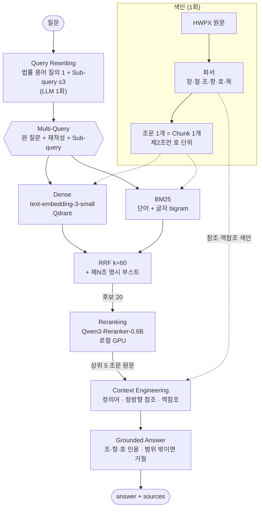

# AI 기본법 근거 기반 QA

**「인공지능기본법」에 대한 질문에 조·항·호 단위 근거 조문을 붙여 답하는 RAG 백엔드**

필요한 조문을 상위 5위 안에 확보하는 비율을 **61% → 84%**, LLM에 넘기는 Context가 정답 조문을 담는 비율을 **98%** 까지 올렸습니다.
기법을 하나씩 쌓으며 Golden Test Set 40문항으로 어떤 기법이 실제로 효과가 있었는지를 숫자로 확인했습니다.

   


<sub>질문 하나를 보내면 근거를 찾는 4단계(질문 다듬기 → 조문 검색 → 관련도 재정렬 → 답변 작성)가 진행되고, 문장마다 인용 번호가 붙은 답변이 나옵니다. 인용을 누르면 해당 조·항이 강조된 원문 패널이 열립니다. 실제 서비스를 녹화했고, 처리 대기 구간만 6배속으로 줄였습니다. 원본 영상은 [demo.mp4](docs/images/demo.mp4)입니다.</sub>

---

## 목차
1. [문제 정의](#1-문제-정의)
2. [결과 요약](#2-결과-요약)
3. [아키텍처](#3-아키텍처)
4. [문제 해결 과정](#4-문제-해결-과정) — 단계별 문제 → 가설 → 실험 → 결과 → 트레이드오프
5. [버린 선택지](#5-버린-선택지)
6. [평가 방법](#6-평가-방법)
7. [한계와 다음 단계](#7-한계와-다음-단계)
8. [실행 방법](#8-실행-방법)
9. [프로젝트 구조와 문서](#9-프로젝트-구조와-문서)

---

## 1. 문제 정의

| | |
|---|---|
| **대상** | 「인공지능 발전과 신뢰 기반 조성 등에 관한 기본법」 법률 제21311호(2026. 7. 21. 시행), 조문 46개 |
| **요구** | `POST /ask` `{"question"}` → `{"answer", "sources": [{"article", "content"}]}` |
| **어려운 점** | ① 일반 LLM은 이 법을 어느 정도 알지만 **조문 번호를 지어냅니다**. LLM 단독으로 답하게 했을 때 할루시네이션이 90%였습니다.<br>② 사용자는 "우리 가게 챗봇"처럼 **일상어**로 묻지만, 법은 "인공지능사업자"·"고지"라고 씁니다.<br>③ "어기면 어떻게 돼?"는 의무 조문과 **그 의무를 가리키는 제재 조문**을 함께 봐야 답할 수 있습니다(multi-hop). |
| **기준** | 사람이 1분 안에 원문과 대조할 수 있을 것. 그래서 출처는 RFP가 요구한 "제○조"보다 세밀한 **조·항·호**(`제43조①2`)까지 답니다. |

**API 응답 예시** (`/docs` Swagger UI에서 실제로 호출한 결과)

<details>
<summary>"AI로 만든 사진을 앱에서 보여줄 때 뭘 해야 해?" — 펼쳐 보기</summary>


답변 문장마다 `[제31조②]`·`[제31조③]`·`[제31조④]` 인용이 붙습니다. 세부 기준이 대통령령에 위임된 부분(④)은 따로 표시하고, `sources`에는 각 항의 원문을 그대로 담습니다.
</details>

## 2. 결과 요약


| 방식 (같은 모델·같은 채점 기준, 20문항) | 정확도 | 할루시네이션 | 인용 정확 | 질문당 입력 토큰 |
|---|---|---|---|---|
| LLM 단독 | 35% | 90% | 17% | 127 |
| Naive RAG (500자 청크, Dense top4) | 65% | 35% | 60% | 1,475 |
| **Advanced RAG** (이 프로젝트의 검색·Context 구성) | **90%** | **0%** | **100%** | 4,483 |
| 법 전문 통째로 넣기 (상한선 참고용) | 98% | 0% | 100% | 24,355 |

- 법 전문을 통째로 넣으면 정확도는 가장 높지만 토큰이 **5.4배** 듭니다. 시행령까지 붙이면 그 방식은 더 이상 쓸 수 없어서 RAG를 택했습니다.
- 답변 채점은 Golden Test Set 중 처음 20문항(g01~g20)으로 한 결과입니다. 이후 추가한 역참조(C2)의 효과는 검색·Context 지표로 40문항에서 다시 쟀습니다. 답변은 다시 채점하지 않았습니다.

전체 지표는 [성능 리포트](docs/report.html)와 [최종 보고서](docs/final_report.md)에 있습니다. 리포트는 서비스의 `/report`에서도 열 수 있습니다.

## 3. 아키텍처



| 선택 | 이유 |
|---|---|
| 원문: 국가법령정보센터 **HWPX**를 표준 라이브러리로 파싱 | XML 안에 조·항·호 구조가 이미 있습니다. 법제처 Open API 본문과 46개 조문이 모두 일치하는지 테스트로 확인합니다. |
| 벡터 DB: **Qdrant** | Docker 한 줄로 띄웁니다. 문서 지문이 같으면 다시 임베딩하지 않습니다. |
| Reranker: **Qwen3-Reranker-0.6B** | 로컬 GPU(RTX 4060 8GB)에서 돌아 API 비용이 0이고 한국어를 지원합니다. |
| 서버: **FastAPI** + SSE | 단계 이벤트와 답변 토큰을 실시간으로 보냅니다. 화면의 "검색 과정 보기"에서 Rewritten Query·Reranker 점수·첨부된 참조를 그대로 공개합니다. |

## 4. 문제 해결 과정

기법을 한 번에 하나씩 더하고, 매번 같은 Golden Test Set으로 다시 쟀습니다. **나아진 문항과 나빠진 문항을 문항 번호까지** 추적했습니다.


<sub>S0~S4는 검색 순위 지표입니다. C1·C2는 검색 순위는 S4 그대로 두고 LLM에 넘기는 Context에 조문을 더 붙인 단계라, 순위 지표 없이 Context 전체 기준 Recall만 잽니다. Hit@3은 상위 3개에 정답 조문이 하나라도 있는 비율, Recall@5는 정답 조문 중 상위 5개에 든 비율, MRR은 첫 정답 순위의 역수 평균입니다. 범위 안 35문항, 조 단위 기준입니다.</sub>

### S1. Chunking — 500자 분할이 정의와 목록을 끊는다
- **문제**: 500자 고정 창이 제2조 정의나 "다음 각 호" 목록을 중간에서 잘라, "무엇에 대한 과태료인지" 같은 맥락이 사라졌습니다.
- **가설**: 법은 조문 자체가 의미 단위이니, 조문 경계로 자르면 검색 단위와 의미 단위가 맞을 것이다.
- **실험**: 조문 1개 = Chunk 1개로 바꿨습니다. 1,911자인 제2조(정의)만 호 단위로 나누고, 각 Chunk 앞에 정의 문장 머리말과 `[장 > 절 > 제N조(제목)]` 경로를 붙였습니다.
- **결과**: Hit@3 66% → **83%**, MRR 0.58 → **0.78**.

### S2. Hybrid — 임베딩이 고유명사·조문 번호를 뭉갠다
- **문제**: "제36조", "국내대리인"처럼 정확히 일치해야 하는 단어를 임베딩이 흐리게 처리했습니다.
- **실험**: Dense + BM25를 RRF(k=60)로 합쳤습니다. 형태소 분석기를 새로 들이지 않고 "공백 단어 + 글자 bigram"으로 한국어 조사·복합어를 견디게 했습니다. 질문에 `제N조`가 있으면 그 조문을 맨 앞에 둡니다.
- **결과**: Hit@3 83% → **89%**, 그런데 **Recall@5는 75% → 71%로 떨어졌습니다.**
- **분석과 트레이드오프**: 떨어진 문항(g02, g22)은 일상어 질문이었습니다. "우리 가게 챗봇"은 법 어휘와 겹치지 않아 BM25가 엉뚱한 조문을 올렸습니다. 그래서 Hybrid를 단독으로 쓰지 않고, **다음 단계에서 법률 용어로 바꾼 질의에 BM25를 걸도록** 쌓았습니다.

### S3. Query Rewriting + Multi-Query — 일상어와 법률 용어의 거리
- **문제**: 사용자 어휘와 법 어휘가 멀고, 쟁점이 둘인 질문("안 두면 어떻게 되고, 무슨 일을 대신해?")은 한쪽만 찾았습니다.
- **실험**: LLM 1회로 `{"rewrite": 법률 용어 질의, "subqueries": [≤3]}`를 만들고, 원 질문·재작성·Sub-query를 각각 검색해 RRF로 합쳤습니다. **답변에는 원 질문을 씁니다.** 재작성이 질문 의도를 바꾸는 위험을 막기 위해서입니다. JSON이 깨지면 원 질문만으로 계속 진행합니다.
- **결과**: Hit@3 89% → **94%**, Recall@5 71% → **79%**, MRR 0.80 → **0.94**. S2에서 떨어졌던 g02·g22가 회복됐습니다.

### S4. Reranking — 정답은 후보 안에 있는데 순위가 밀린다
- **문제**: 후보 20개 안에 정답이 있어도 5위 밖으로 밀렸습니다. 임베딩은 질문과 문서를 따로 인코딩하기 때문입니다.
- **실험**: cross-encoder Reranker로 원 질문 기준 20개 → 5개로 다시 정렬했습니다.
- **결과**: Hit@3 **100%**, MRR **1.00**, Recall@5 **84%**.
- **트레이드오프**: 정답 조문이 여러 개인 multi-hop 문항(g13, g14, g32)에서는 "제재" 같은 보조 쟁점 조문을 5위 밖으로 밀어냈습니다. 원 질문 하나와만 비교하기 때문입니다. 이 손실은 다음 단계인 Context 구성에서 보완합니다.

### C1·C2. Context Engineering — 검색이 완벽해도 답에 필요한 조문이 빠진다

<table><tr><td width="58%">

**문제**: S4로 Hit@3이 100%가 됐는데도, 상위 5개만 넘기면 **multi-hop 문항에서는 정답 조문의 절반(47%)만** 들어갔습니다.

**원인**: 이 법은 **제재 조문이 의무 조문을 가리키는** 구조입니다. `제43조①2: 제36조제1항을 위반하여 국내대리인을 지정하지 아니한 자 → 3천만원 이하 과태료`. 정방향 참조(A가 가리키는 B)만 따라가면 "국내대리인을 안 두면?"에서 제36조는 찾아도 제43조는 영영 따라오지 않습니다.

**해결 (C2 역참조)**: 법 본문에서 제재·조사 조문(제40·42·43조) → 피참조 조문 **역색인**을 자동으로 만들었습니다. 상위 조문을 가리키는 제재 조항이 있으면 **그 호와 소속 항의 첫 줄만** 붙입니다.
- 추가 LLM 호출은 0회입니다.
- 제재 조문 전체를 붙이지 않아 토큰이 소폭만 늘어납니다.

**결과**: Context Recall 90% → **98%**, multi-hop 문항 66% → **93%**. 이전 실험이 최대 약점으로 지목한 4문항(g02·g11·g12·g15)이 모두 해결됐습니다.

**시행착오**: 처음엔 항(①) 단위로 역색인했더니 항 본문에 각 호가 포함돼 같은 참조가 두 번 잡혔습니다. 그래서 **더 구체적인 단위(호) 하나만** 남기도록 바꾸고 테스트로 고정했습니다.

</td><td>


</td></tr></table>

C1(정의·정방향 참조)도 함께 넣었습니다.
- **정의어**: 질문에 정의어가 나오는데 정의 조문이 상위에 없으면 **그 정의 호만** 붙입니다. 정의어는 제2조 각 호와 본문의 `(이하 "X"라 한다)`에서 자동으로 뽑습니다.
- **정방향 참조**: 본문의 `제N조제M항` 참조는 1단계만 **해당 항·호만**, 최대 6개까지 붙입니다.


<sub>multi-hop 문항은 S4까지 47%에 머물다가 Context 단계에서 93%로 올랐습니다. 98%(전체 35문항)와 93%(multi-hop 9문항)는 기준이 다른 수치이며, 문항 수로 가중 평균하면 일치합니다.</sub>

### Grounded Answer — 근거 밖 사실을 막고, 원문을 바꾸지 않는다
- **원문 그대로**: 상위 조문은 요약하지 않고 원문 그대로 넣습니다. 생성식 요약이 "노력하여야 한다"(노력의무)를 "해야 한다"(의무)로 바꿔 놓은 것을 확인했기 때문입니다. 법률 답변에서 이 차이는 오답입니다.
- **프롬프트 규칙**
  1. Context 밖의 사실은 쓰지 않습니다.
  2. 주장마다 `[제34조①]` 형식으로 인용합니다.
  3. 근거가 없으면 "제공된 조문에서는 확인할 수 없습니다"라고만 답합니다.
  4. 대통령령에 위임된 내용은 표시합니다.
  5. 5문장 이내로 씁니다.
- **인용 검증**: 응답의 `sources`는 답변에 실제로 인용된 조·항·호의 원문만 담습니다.

## 5. 버린 선택지

| 시도 | 버린 이유 (측정값) | 대신 택한 것 |
|---|---|---|
| **Reranker 점수로 범위 밖 질문 차단** (최대 logit < 0.91) | 범위 안의 일상어·multi-hop 질문 **6/18을 잘못 거절**해 정확도가 90%에서 **65%** 로 떨어졌습니다. 일상어는 조문과 표면이 달라 점수가 낮을 뿐 범위 밖이 아니었습니다. | 거절은 생성 단계 규칙에 맡겼습니다. 이 규칙만으로 범위 밖 2/2를 올바로 거절했고, 점수는 화면에 투명하게 공개합니다. |
| **법 전문 통째로 넣기** | 정확도 98%지만 토큰이 **5.4배**이고, 시행령까지 붙이면 Context 한도를 넘습니다. | RAG |
| **Docling 등 범용 문서 로더** (RFP 제안) | HWPX XML에 구조가 이미 있어서 범용 로더는 구조를 버리고 다시 추측하게 됩니다. | 표준 라이브러리 파서 + Open API 본문과의 일치 테스트 |
| **500자 고정 분할** | Hit@3 66%. 정의와 목록을 중간에서 자릅니다. | 조문 단위 Chunking |
| **생성식 Context 요약** | 노력의무를 의무로 바꿔 놓았습니다. | 원문 그대로 + 필요한 항·호만 첨부 |

## 6. 평가 방법

- **Golden Test Set 40문항** ([`docs/eval_set/`](docs/eval_set/))
  - 유형: 일상어 12, 조문번호·고유명사 7, multi-hop 9, 정의·세부 7, 범위 밖 5
  - **g01~g20은 동결**했습니다. 이전 실험과 같은 문항이라 수치를 그대로 비교할 수 있습니다.
  - **g21~g40은 빈 곳을 채우려고 추가**했습니다. 역방향 multi-hop, 노력의무, 대통령령 위임, 범위 밖 함정처럼 이전 문항이 다루지 않던 경우입니다.
- **정답 근거는 기계로 검증합니다**: 각 문항의 `evidence` 인용문이 원문에 그대로 있는지 확인하며, 40문항 모두 통과했습니다.
- **채점 LLM을 그대로 믿지 않습니다**: 채점 LLM은 거절을 정답으로 처리하거나, 언급하지도 않은 과태료를 "설명했다"고 판정하는 일이 있었습니다(이전 실험에서 12건 수정). 사람이 다시 본 판정은 `eval/overrides.json`에 이유와 함께 남겨 집계에 반영합니다.
- **과적합을 막습니다**: 임계값 같은 파라미터는 Golden Test Set이 아니라 별도의 probe set(8문항)으로만 정합니다.
- **수치 읽는 법**: 40문항이라 1문항이 2.5%p입니다. 수치는 경향으로 읽어 주세요.

## 7. 한계와 다음 단계

- **시행령 미포함**: 33개 조문이 세부 사항을 대통령령에 위임합니다. 지금은 "대통령령으로 정한다"고 표시만 합니다. 다음 단계는 시행령을 같은 파서로 넣고, 법 조문 ↔ 시행령 위임 관계를 역참조와 같은 방식으로 잇는 것입니다.
- **두 단계 연결**: 의무 → 시정명령 → 과태료처럼 두 단계를 거치는 연결은 역참조 1단계로 닿지 않습니다(g31).
- **답변 재채점 미실시**: 역참조를 넣은 뒤의 답변 정확도는 다시 채점하지 않았습니다. Context에 필요한 조문이 들어간 것까지만 측정했습니다.
- **채점의 한계**: 채점 LLM이 같은 계열이라 관대할 수 있어, 사람의 재검토가 필요합니다.

## 8. 실행 방법

```bash
cp .env.example .env                                  # LLM_API_KEY 입력
cd docker-qdrant && docker compose up -d && cd ..     # Qdrant (6333)
uv sync
uv run uvicorn app.main:app --port 8000               # http://localhost:8000 · /docs · /report
```

```bash
curl -s localhost:8000/ask -H 'Content-Type: application/json' \
  -d '{"question": "외국 AI 회사가 국내대리인을 안 두면 어떻게 돼?"}'
# {"answer": "... 3천만원 이하의 과태료를 부과합니다[제43조①2] ...",
#  "sources": [{"article": "제36조①", "content": "① 국내에 주소 또는 영업소가 없는 ..."}, ...]}
```

<details>
<summary>테스트·평가·리포트 명령</summary>

```bash
uv run pytest                                         # 파서 ↔ Open API 대조, Context·인용 로직 (LLM 호출 없음)
uv run python eval/evaluate.py --budget 1500          # 검색 단계별 평가 (--answers: 답변·채점까지)
uv run python eval/report.py                          # docs/report.html · final_report.md 표 갱신
```

- Reranker 모델(약 1.2GB)은 캐시된 것만 씁니다(`HF_HUB_OFFLINE=1`). 처음 한 번은 `HF_HUB_OFFLINE=0 uv run uvicorn app.main:app --port 8000`으로 서버를 띄운 뒤 질문 하나를 보내야 모델을 내려받습니다. 모델은 서버가 켜진 뒤 첫 질문 때 GPU에 올라가고, GPU가 없으면 CPU로 돌아 느립니다.
- uv 단일 가상환경과 노트북 설정은 [docs/dev_setup.md](docs/dev_setup.md)에 있습니다.
</details>

## 9. 프로젝트 구조와 문서

```text
rag/
  loader.py        HWPX → 장·절·조·항·호·목 (부칙 앞에서 중단, 개정 표시 제거)
  chunker.py       조문 = Chunk, 제2조만 호 단위 · 500자 비교군
  vectorstore.py   Qdrant 색인 (지문이 같으면 다시 임베딩하지 않음)
  retriever.py     Dense · BM25 · RRF · 제N조 부스트 · Multi-Query
  reranker.py      Qwen3-Reranker-0.6B
  pipeline.py      Query Rewriting → 검색 → Reranking → Context Engineering → Grounded Answer (SSE 이벤트)
app/               FastAPI (/ask, /ask/stream, /articles, /report) + 화면
eval/              evaluate.py (S0~S4, C0~C2, 답변·채점) · report.py (리포트 생성)
common/            설정 · LLM·임베딩 모델 생성 · Qdrant 클라이언트
tests/             파서·Context·인용 테스트, UI 확인용 목 서버
```

| 문서 | 내용 |
|---|---|
| [docs/final_report.md](docs/final_report.md) | 단계별 문제점 · 해결 방법 선정 기준 · 시행착오 · 개선 포인트 |
| [docs/report.html](docs/report.html) | 성능 리포트(문항별 히트맵 포함). 서비스의 `/report`에서도 열 수 있습니다. |
| [docs/eval_set/](docs/eval_set/) | Golden Test Set 40문항 · probe set · 채점 기준 |
| [notebook/rag_experiments.ipynb](notebook/rag_experiments.ipynb) | 원문 로딩부터 단계별 차이를 직접 실행해 보는 실습 노트북 (LLM 호출 없이 실행 가능) |
