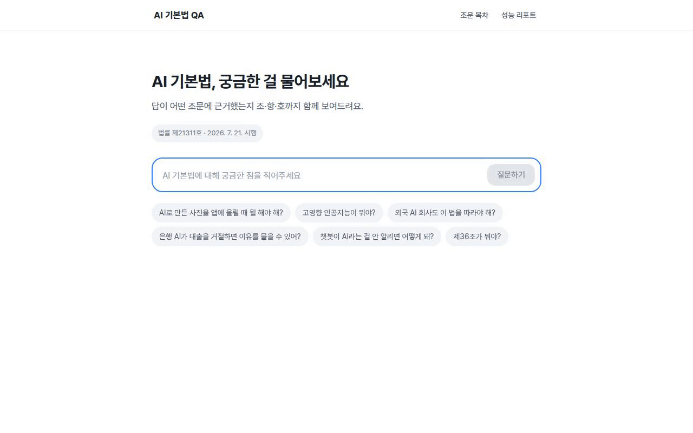
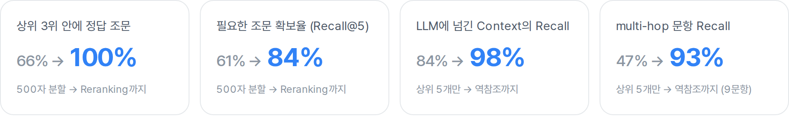
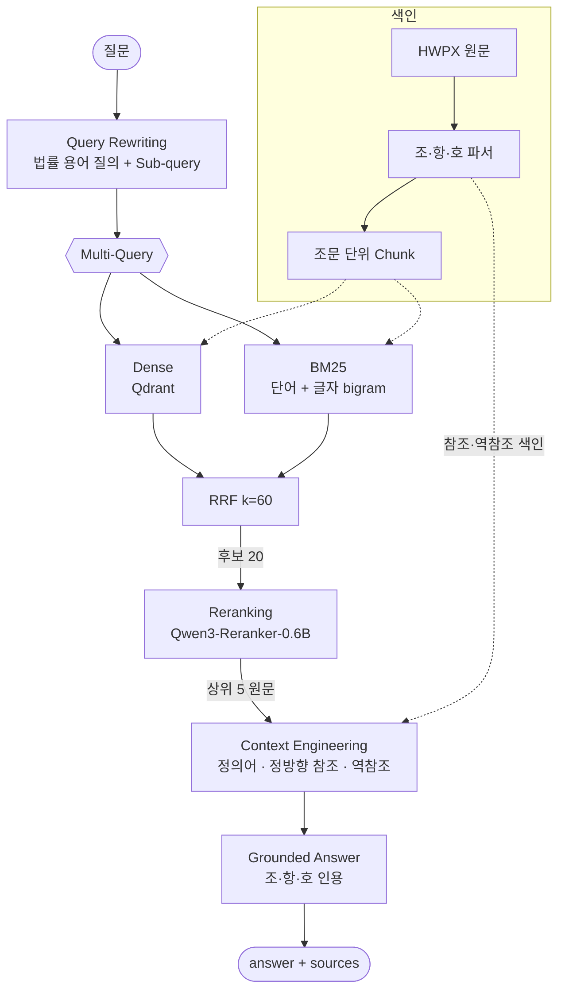
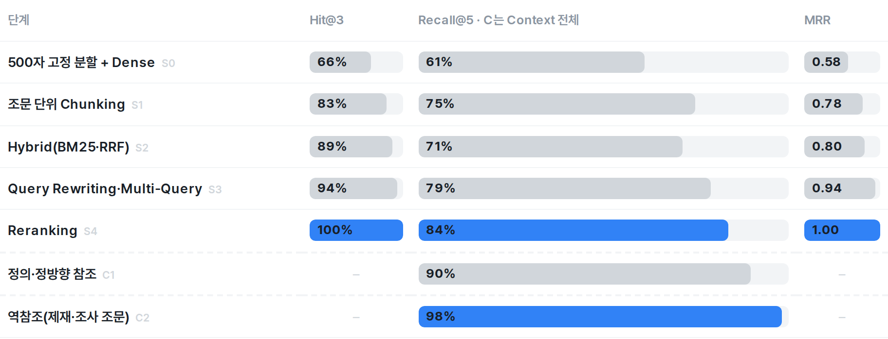
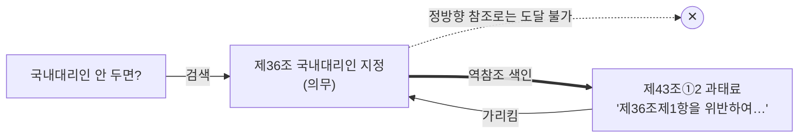
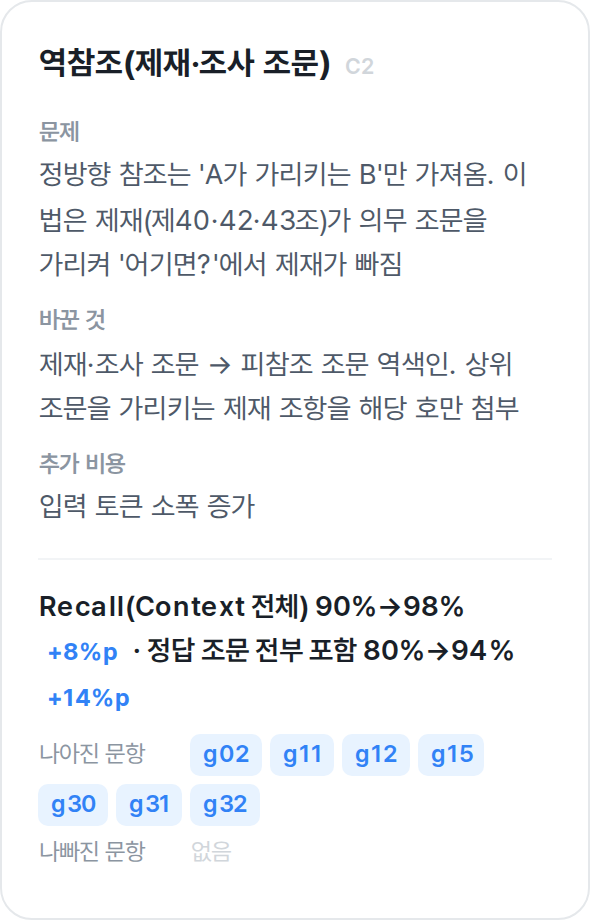
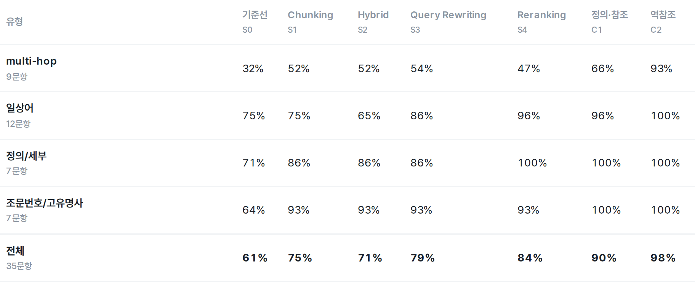

# AI 기본법 근거 기반 QA

「인공지능기본법」 질문에 **조·항·호 단위 근거 조문**을 붙여 답하는 RAG 백엔드

   



<sub>질문 → 근거 탐색 4단계 → 인용 번호가 붙은 답변 → 인용 클릭 시 해당 조·항 원문 패널. 처리 대기 구간만 6배속([원본 mp4](docs/images/demo.mp4)).</sub>

**개선 결과** — Golden Test Set 40문항, 기법 적용 전 → 후



| 목차 | |
|---|---|
| [1. 문제 정의](#1-문제-정의) | [5. 시행착오](#5-시행착오) |
| [2. 결과](#2-결과) | [6. 평가](#6-평가) |
| [3. 아키텍처](#3-아키텍처) | [7. 한계](#7-한계) |
| [4. 개선 과정](#4-개선-과정) | [8. 실행](#8-실행) |

## 1. 문제 정의

| 어려움 | 예 |
|---|---|
| LLM 단독 답변은 조문 번호를 지어냄 | 할루시네이션 **90%** |
| 사용자는 일상어, 법은 법률 용어 | "우리 가게 챗봇" ↔ "인공지능사업자", "고지" |
| 답에 조문 여러 개가 필요(multi-hop) | "국내대리인 안 두면?" → 의무 제36조 + 과태료 제43조 |

- 대상: 법률 제21311호(2026. 7. 21. 시행), 조문 46개
- API: `POST /ask` `{"question"}` → `{"answer", "sources": [{"article": "제43조①2", "content": "원문"}]}`

<details>
<summary>응답 예시 (Swagger UI)</summary>


</details>

## 2. 결과

같은 모델(gpt-5.4-mini), 같은 채점 기준, 20문항

| 방식 | 정확도 | 할루시네이션 | 인용 정확 | 입력 토큰 |
|---|---:|---:|---:|---:|
| LLM 단독 | 35% | 90% | 17% | 127 |
| Naive RAG | 65% | 35% | 60% | 1,475 |
| **Advanced RAG** | **90%** | **0%** | **100%** | 4,483 |
| 법 전문 통째로 (참고) | 98% | 0% | 100% | 24,355 |

법 전문 방식은 토큰 5.4배, 시행령까지 붙이면 불가 → RAG 선택

## 3. 아키텍처



| 구성 | 선택 | 이유 |
|---|---|---|
| 원문 | HWPX 직접 파싱 | XML에 조·항·호 구조 존재, Open API 본문과 46개 전부 일치 확인 |
| 벡터 DB | Qdrant | Docker 한 줄, 문서 지문이 같으면 재임베딩 생략 |
| Reranker | Qwen3-Reranker-0.6B | 로컬 GPU, API 비용 0, 한국어 지원 |
| 서버 | FastAPI + SSE | 단계 이벤트·토큰 실시간 전송, 검색 과정 화면 공개 |

## 4. 개선 과정

기법을 하나씩 더하며 같은 Golden Test Set으로 재측정
S = 검색 단계(S0 기준선 → S4, 앞 단계에 누적), C = LLM에 넘기는 Context 구성 단계



| 단계 | 문제 | 해결 | 결과 |
|---|---|---|---|
| Chunking (S1) | 500자 분할이 정의·목록을 자름 | 조문 1개 = Chunk 1개 (제2조만 호 단위) | Hit@3 66 → **83%** |
| Hybrid Search (S2) | 임베딩이 고유명사·조문 번호를 놓침 | Dense + BM25, RRF | Hit@3 → **89%** · Recall@5 75 → 71% ▼ |
| Query Rewriting (S3) | 일상어 ↔ 법률 용어 거리 | 법률 용어 재작성 + Sub-query | Recall@5 → **79%** · MRR → **0.94** |
| Reranking (S4) | 정답이 후보 안에 있지만 순위 밀림 | Cross-encoder 20 → 5 | Hit@3 **100%** · MRR **1.00** |
| 정의·참조 첨부 (C1) | 정의 조문·참조 조문 누락 | 정의 호, 참조 항·호 첨부 | Context Recall → **90%** |
| 역참조 (C2) | 제재 조문이 Context에 안 들어옴 | 제재 조문 역색인 | Context Recall → **98%** |

### 핵심: 역참조

검색이 완벽해도(Hit@3 100%) multi-hop 질문은 정답 조문의 **47%** 만 Context에 들어감



<table><tr><td width="55%">

| | multi-hop Recall |
|---|---:|
| 상위 5개만 (C0) | 47% |
| + 정의·정방향 참조 (C1) | 66% |
| **+ 역참조 (C2)** | **93%** |

- 추가 LLM 호출 0회
- 제재 조항의 해당 호 + 항 첫 줄만 첨부 → 토큰 증가 최소
- 기존 약점 4문항(g02·g11·g12·g15) 전부 해결

</td><td>



</td></tr></table>



<details>
<summary>단계별 상세 (가설 · 트레이드오프 · 시행착오)</summary>

**Chunking (S1)**
- 가설: 법은 조문이 의미 단위
- 1,911자인 제2조(정의)만 호 단위로 분할, 모든 Chunk 앞에 `[장 > 절 > 제N조(제목)]` 경로

**Hybrid Search (S2)**
- 형태소 분석기 없이 공백 단어 + 글자 bigram으로 한국어 조사 대응
- 질문에 `제N조`가 있으면 해당 조문 우선
- 트레이드오프: 일상어 질문(g02, g22)에서 BM25가 엉뚱한 조문을 올려 Recall 하락 → Query Rewriting(S3)에서 법률 용어로 바꾼 질의에 BM25를 걸어 회복

**Query Rewriting (S3)**
- LLM 1회로 `{"rewrite", "subqueries": [≤3]}` 생성, 원 질문·재작성·Sub-query 각각 검색 후 RRF
- 답변에는 원 질문 사용 (재작성이 의도를 바꾸는 위험 차단)
- JSON 파싱 실패 시 원 질문만으로 계속

**Reranking (S4)**
- 트레이드오프: 정답이 여러 개인 multi-hop(g13, g14, g32)에서 보조 쟁점 조문이 5위 밖으로 밀림 → 역참조(C2)에서 보완

**정의·참조 첨부 (C1)**
- 정의어: 제2조 각 호 + 본문의 `(이하 "X"라 한다)` 자동 추출, 정의 조문이 상위에 없을 때만 첨부
- 정방향 참조: `제N조제M항` 1단계, 해당 항·호만 최대 6개

**역참조 (C2)**
- 대상: 제40조(사실조사), 제42조(벌칙), 제43조(과태료)
- 시행착오: 항 단위 색인 시 항 본문에 호가 포함돼 같은 참조가 중복 → 더 구체적인 단위(호) 하나만 남기도록 수정, 테스트로 고정

**Grounded Answer**
- 상위 조문은 원문 그대로 (요약 시 "노력하여야 한다"가 "해야 한다"로 바뀌는 문제 확인)
- 규칙: Context 밖 사실 금지 · 주장마다 `[제34조①]` 인용 · 근거 없으면 거절 · 대통령령 위임 표시 · 5문장 이내
- `sources`에는 답변에 실제로 인용된 조·항·호 원문만 포함
</details>

## 5. 시행착오

| 시도 | 문제 | 해결 |
|---|---|---|
| Reranker 점수로 범위 밖 질문 차단 | 답할 수 있는 질문 6/18까지 거절, 정확도 90 → 65% | 답변 프롬프트의 거절 규칙 (범위 밖 질문 2개 모두 거절) |
| 법 전문 통째로 | 토큰 5.4배, 시행령 추가 시 한도 초과 | RAG |
| Docling 등 범용 로더 | HWPX에 이미 있는 조·항·호 구조를 활용 못 함 | 표준 라이브러리 파서 |
| 500자 고정 분할 | Hit@3 66%, 정의·목록 단절 | 조문 단위 Chunking |
| 생성식 Context 요약 | "노력하여야 한다"가 "해야 한다"로 바뀜 | 원문 + 필요한 항·호만 |

## 6. 평가

| 항목 | 내용 |
|---|---|
| Golden Test Set | 40문항 ([docs/eval_set](docs/eval_set/)) · 일상어 12 · 조문번호 7 · multi-hop 9 · 정의 7 · 범위 밖 5 |
| 비교 기준 | g01–g20 동결(이전 실험과 비교), g21–g40 추가(역방향 multi-hop · 노력의무 · 대통령령 위임 · 범위 밖 함정) |
| 정답 검증 | `evidence` 인용문이 원문에 그대로 있는지 기계 검사 (40/40 통과) |
| 채점 보정 | LLM 채점 오판을 사람이 재검토해 `overrides.json`에 이유와 함께 기록 (이전 실험 12건) |
| 과적합 방지 | 임계값은 Golden Test Set이 아닌 별도 probe set(8문항)으로만 결정 |

40문항이라 1문항 = 2.5%p, 경향으로 해석

## 7. 한계

- 시행령 미포함: 33개 조문이 대통령령에 위임 → 다음 단계는 시행령을 같은 파서로 넣고 위임 관계를 역참조처럼 연결
- 의무 → 시정명령 → 과태료처럼 두 단계를 거치는 연결은 미지원 (g31)
- 역참조 추가 후 답변 정확도는 재채점하지 않음 (Context 포함 여부까지만 측정)

## 8. 실행

```bash
cp .env.example .env                                  # LLM_API_KEY 입력
cd docker-qdrant && docker compose up -d && cd ..     # Qdrant
uv sync
uv run uvicorn app.main:app --port 8000               # / · /docs · /report
```

<details>
<summary>테스트 · 평가 · 참고</summary>

```bash
uv run pytest                                  # 파서 ↔ Open API 대조, Context·인용 로직
uv run python eval/evaluate.py --budget 1500   # 단계별 검색 평가 (--answers: 답변 채점 포함)
uv run python eval/report.py                   # 리포트 갱신
```

- Reranker 모델(약 1.2GB)은 캐시된 것만 사용. 처음 한 번은 `HF_HUB_OFFLINE=0`으로 서버를 띄우고 질문 1개를 보내 다운로드
- uv 가상환경·노트북 설정: [docs/dev_setup.md](docs/dev_setup.md)
</details>

```text
rag/        loader · chunker · vectorstore · retriever · reranker · pipeline
app/        FastAPI (/ask, /ask/stream, /articles, /report) + 화면
eval/       단계별 평가 · 리포트 생성
tests/      파서 · Context · 인용 테스트
```

| 문서 | |
|---|---|
| [최종 보고서](docs/final_report.md) | 단계별 문제점 · 선정 기준 · 시행착오 · 개선 포인트 |
| [성능 리포트](docs/report.html) | 문항별 히트맵 포함 (서비스 `/report`) |
| [실습 노트북](notebook/rag_experiments.ipynb) | 원문 로딩부터 단계별 차이 실습 (LLM 호출 없이 실행 가능) |
