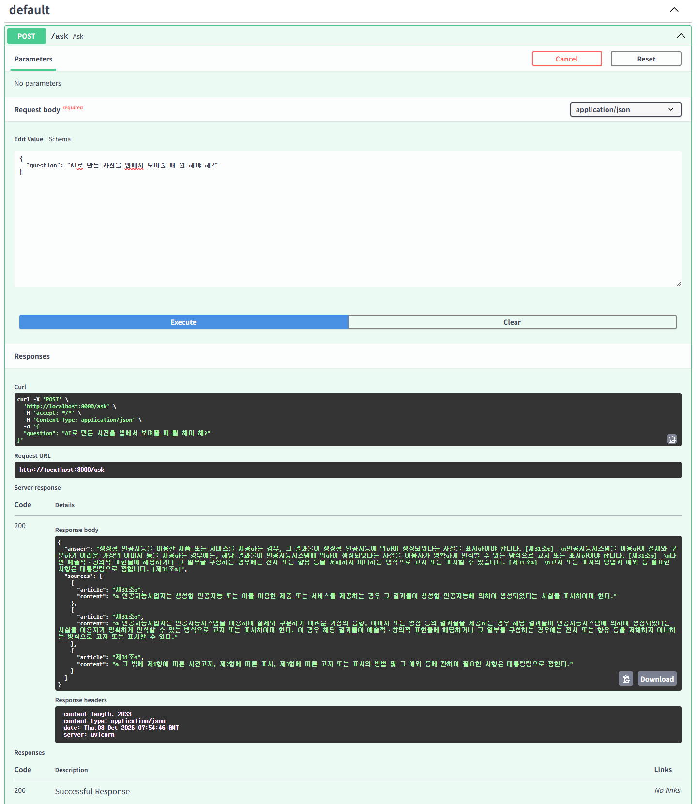

# AI 기본법 근거 기반 QA — 최종 보고서

> 「인공지능 발전과 신뢰 기반 조성 등에 관한 기본법」(법률 제21311호, 2026. 7. 21. 시행, 46개 조문)을 근거로 답하는 RAG QA 서비스.
> 이 문서는 **RAG 단계마다 무엇이 문제였고, 무엇을 기준으로 해결책을 골랐고, 어떤 시행착오를 거쳐 무엇이 나아졌는지**를 기록한다.
> 표 안의 숫자는 `eval/report.py`가 `eval/results.json`에서 자동으로 채운다(`<!-- AUTO -->` 블록, 손으로 고치지 말 것). 시각화는 `docs/report.html`(서비스의 `/report`).

<!-- AUTO:meta -->
Golden Test Set `docs/eval_set/golden_set.jsonl` 40문항 중 40문항 평가(범위 안 35문항) · multi-hop 9 · out-of-scope 5 · 일상어 12 · 정의/세부 7 · 조문번호/고유명사 7 · 생성일 2026-10-09
<!-- /AUTO -->

## 0. 한눈에 보기

<!-- AUTO:summary -->
- **상위 3위 안에 정답 조문**: 66% → **100%** (500자 분할 → Reranking까지)
- **필요한 조문 확보율 (Recall@5)**: 61% → **84%** (500자 분할 → Reranking까지)
- **LLM에 넘긴 Context의 Recall**: 84% → **98%** (상위 5개만 → 역참조까지)
- **multi-hop 문항 Recall**: 47% → **93%** (상위 5개만 → 역참조까지 (9문항))
<!-- /AUTO -->

이번 프로젝트의 세 질문에 대한 답:

| RFP 질문 | 이 시스템의 답 | 확인 방법 |
|---|---|---|
| 이 답변은 어떤 문서를 근거로 만들어졌는가? | 모든 주장 뒤에 `[제43조①2]`처럼 조·항·호 인용 → `sources[].content`에 그 단위의 **원문 그대로** | UI 인용 칩 → 조문 패널 하이라이트, 채점의 `citations_valid` |
| 필요한 법률 조항을 제대로 검색했는가? | 검색 단계마다 Hit@3·Recall@5·MRR, Context 단계마다 Recall(LLM에 넘긴 Context 전체 기준) 측정 | Golden Test Set 40문항, `eval/evaluate.py` |
| 검색 품질을 어떻게 개선할 수 있는가? | 기법을 하나씩 쌓으며 나아진/나빠진 문항까지 추적 (아래 단계별 표) | 단계 계단 S0→S4, Context C0→C2 |

---

## 1. Document Processing (문서 로딩)

**문제** — RFP는 Docling 로딩을 제안했다. 하지만 원본이 HWPX(한글 XML)라서 조·항·호·목이 이미 문단 단위로 구분돼 있다. PDF 경로로 바꿔 다시 추출하면 들여쓰기·번호 체계 같은 구조 신호를 잃는다.

**선정 기준** — ① 법률 구조(장·절·조·항·호·목)를 잃지 않을 것 ② 원문과 글자 단위로 일치함을 **검증할 수 있을 것** ③ 새 의존성 없이.

**해결** — `zipfile` + `xml.etree`로 `Contents/section*.xml`의 문단을 직접 읽는다(`rag/loader.py`). 줄 머리 패턴으로 구조를 판별한다: `제N조(의M)(제목)` / `①` / `  1.`·`  4의2.` / `    가.`.

**시행착오**
- `제N장`, `제N절` 줄을 본문으로 두면 **앞 조문 끝에 붙는다** → breadcrumb 메타데이터로 분리.
- 부칙에도 제1조~가 있어 **번호가 겹친다** → `부칙 <법률 …>` 줄에서 파싱 중단.
- 문서 앞 머리말(법령명 반복, `법제처 - / - 국가법령정보센터`, 담당부서 전화번호) → 첫 `제1장` 전까지 버림.
- 개정 표시 제거 정규식이 `<개정 …>`·`[본조신설 …]`만 다뤄 **`[제목개정 2026. 1. 20.]`(제7조)** 이 남음 → Open API 대조 테스트가 잡아냄. `[...개정|신설|시행일...]`로 일반화.
- 가지조문 라벨을 `제17의2조`로 만듦 → 법령 표기는 `제17조의2`. 대조 테스트에서 KeyError로 발견.
- 제2조처럼 **항 없이 호만 있는** 조문은 "이름 없는 항"으로 처리해야 호 라벨(`제2조4`)이 일관됨.

**개선 포인트** — 법제처 Open API로 받은 46개 조문과 **공백·따옴표·개정표시 정규화 후 전부 일치**(`tests/test_loader.py`, 파서를 바꾸면 이 테스트가 회귀를 막는다). 출력 단위를 `{label: "제43조①2", text}`까지 내려, 이후 인용·하이라이트가 호 단위로 가능해졌다.

## 2. Chunking

**문제** — 500자 고정 분할은 정의(제2조 12개 호, 약 1,900자)와 목록(제43조 각 호)을 중간에서 자른다. "3천만원 이하의 과태료"와 "제36조제1항을 위반하여 국내대리인을 지정하지 아니한 자"가 다른 청크로 갈라지면 어느 쪽도 질문에 온전히 답하지 못한다.

**선정 기준** — 법의 최소 의미 단위는 조문이다. 조문 길이 분포가 짧아(대부분 수백 자) 한 조문이 임베딩 한 번에 충분히 들어간다. 예외는 길이와 주제가 여러 개인 조문뿐.

**해결** — 조문 1개 = 청크 1개, 앞에 `[장 > 절 > 제N조(제목)]` breadcrumb. 제2조만 호 단위로 쪼개고 각 청크 앞에 "이 법에서 사용하는 용어의 뜻은 다음과 같다."를 붙여 정의라는 맥락을 유지(`rag/chunker.py`, 57청크).

**시행착오** — 이전 실험에서 조문 단위(S1)는 Hit@3은 올렸지만 Recall@5는 오히려 낮게 나왔다. 원인은 **지표 쪽 편향**: 500자 청크는 경계에 걸친 조문 2~3개를 모두 "검색됨"으로 세서 S0에 유리하다. 그래서 "검색 지표만 보지 말고 실제로 LLM에 들어가는 내용(Context)과 답변 품질을 같이 본다"는 원칙을 세웠다.

**개선 포인트** — 아래 단계 표의 S0→S1. 조각이 아닌 온전한 조문이 들어가므로, 이후 단계(참조 확장·인용)가 전부 조문 단위로 동작할 수 있게 됐다.

## 3. Embedding·Vector DB

**문제** — MonoRouter 한도(키당 30회/분, 월 크레딧)가 있어 서버를 띄울 때마다 재임베딩하면 비용과 시간이 든다.

**선정 기준** — 같은 입력이면 다시 계산하지 않는다. 결과를 재현할 수 있어야 한다.

**해결** — Qdrant(COSINE) 컬렉션 `law_articles`(구조 청크), `law_naive500`(비교 기준선). (임베딩 모델 + 청크 텍스트) SHA-256 지문을 포인트에 저장하고, 지문이 같으면 임베딩을 건너뛴다(`rag/vectorstore.py`). 질의 여러 개(원 질문·Rewritten Query·Sub-query)는 **요청 1회로 묶어** 임베딩한다.

## 4. Retrieval Engineering

<!-- AUTO:stages -->
| 단계 | 구성 | Hit@3 | Recall@5 | MRR | 나아진 문항 | 나빠진 문항 |
|---|---|---|---|---|---|---|
| 기준선 (S0) | 500자 고정 분할 + Dense | 66% | 61% | 0.58 | – | – |
| Chunking (S1) | 조문 단위 Chunking | 83% | 75% | 0.78 | g05, g07, g11, g12, g14, g27, g30, g32, g33, g36 | g01 |
| Hybrid (S2) | Hybrid(BM25·RRF) | 89% | 71% | 0.80 | g04 | g02, g22 |
| Query Rewriting (S3) | Query Rewriting·Multi-Query | 94% | 79% | 0.94 | g01, g02, g14, g22 | g11 |
| Reranking (S4) | Reranking | 100% | 84% | 1.00 | g03, g04, g11, g16 | g13, g14, g32 |
<!-- /AUTO -->

**읽는 법 (40문항, 범위 안 35문항)**
- 가장 크게 바꾼 것은 S0→S1(조문 단위 Chunking)과 S2→S3(Query Rewriting·Multi-Query), 마지막 S3→S4(Reranking)가 Hit@3·MRR을 100%·1.00으로 끌어올렸다.
- **S2(Hybrid)는 Hit@3·MRR은 올렸지만 Recall@5는 내렸다.** BM25는 질문 단어가 본문에 있을 때 강한데, "우리 가게 챗봇"(g02)같은 일상어는 법 어휘와 안 겹쳐 엉뚱한 조문을 올렸다. 그래서 S2를 단독으로 쓰지 않고, **Query Rewriting으로 법률 용어 질의를 만든 뒤 그 질의에 BM25를 걸도록(S3)** 쌓았다 — g02·g22가 S3에서 회복됐다.
- Reranking은 평균을 올렸지만 g13·g14·g32처럼 정답 조문이 여러 개인 multi-hop에서는 일부를 5위 밖으로 밀어냈다. 원 질문 하나와만 비교하니 "제재" 같은 보조 쟁점 조문의 점수가 낮다. 이 손실은 다음 단계의 Context 확장(특히 역참조)이 보완한다.

유형별 Recall (S0~S4는 상위 5개 = Recall@5, C1·C2는 Context 전체 기준. C0은 S4와 같다):

<!-- AUTO:types -->
| 유형 | 기준선 (S0) | Chunking (S1) | Hybrid (S2) | Query Rewriting (S3) | Reranking (S4) | 정의·참조 (C1) | 역참조 (C2) |
|---|---|---|---|---|---|---|---|
| multi-hop (9) | 32% | 52% | 52% | 54% | 47% | 66% | 93% |
| 일상어 (12) | 75% | 75% | 65% | 86% | 96% | 96% | 100% |
| 정의/세부 (7) | 71% | 86% | 86% | 86% | 100% | 100% | 100% |
| 조문번호/고유명사 (7) | 64% | 93% | 93% | 93% | 93% | 100% | 100% |
| **전체 (35)** | **61%** | **75%** | **71%** | **79%** | **84%** | **90%** | **98%** |
<!-- /AUTO -->

### Hybrid: BM25 + Dense → RRF (S2)
**문제** — 임베딩은 "제36조", "국내대리인" 같은 번호·고유명사를 의미 공간에서 뭉갠다.
**선정 기준** — 형태소 분석기 같은 새 의존성 없이 한국어 조사·복합어에 견딜 것 → BM25 토큰 = 공백 단어 + 공백 제거 글자 bigram. 두 순위의 점수 척도가 달라 **점수 대신 순위를 합치는 RRF(k=60)**. 질문에 `제N조`가 명시되면 그 조문을 맨 앞에(정규식 부스트, 가지조문 `제22조의2`까지).

### Query Rewriting + Multi-Query (S3)
**문제** — "우리 가게 상담 챗봇"은 법 본문의 "인공지능사업자", "고지"와 어휘가 멀다. 쟁점이 둘인 질문("안 두면 어떻게 되고, 무슨 일을 대신해?")은 한쪽만 찾는다.
**선정 기준** — LLM 1회로 끝낼 것(비용), 답변에는 **원 질문**을 쓸 것(Query Rewriting이 질문 의도를 바꾸는 위험 차단).
**해결** — `{"rewrite": 법률용어 질의, "subqueries": [≤3]}` JSON. 원 질문 + Rewritten Query + Sub-query 각각 Hybrid 검색 → RRF. JSON이 깨지면 원 질문만으로 계속(서비스가 멈추지 않게).

### Reranking (S4)
**문제** — 후보 20개 안에 정답은 있는데 순위가 5위 밖으로 밀린다(임베딩은 질문과 문서를 따로 인코딩하므로 세밀한 관련도를 못 봄).
**선정 기준** — 로컬 GPU(RTX 4060 8GB)에서 돌 것(API 크레딧 0), 한국어 지원. → `Qwen/Qwen3-Reranker-0.6B` cross-encoder, 원 질문 기준 20 → 5.
**시행착오 — "Reranker 점수로 범위 밖 질문 차단"은 버렸다.** 이전 실험에서 최대 logit < 0.91(Golden Test Set과 분리된 probe 8문항으로 정함)이면 답변을 거절하게 했더니, 범위 안의 일상어·multi-hop 질문 **6/18을 잘못 거절**해 정확도가 90% → 65%로 떨어졌다. 일상어 질문은 법 조문과 표면이 달라 점수가 낮게 나올 뿐 범위 밖이 아니었다. 차단 없이도 프롬프트 규칙("Context에 없으면 '제공된 조문에서는 확인할 수 없습니다'")만으로 범위 밖 2/2를 올바로 거절했으므로, **거절은 생성 단계 규칙에 맡기고 점수는 화면의 '검색 과정 보기'에 투명하게 보여주는 것**으로 바꿨다.

## 5. Context Engineering

<!-- AUTO:context -->
| 단계 | 구성 | Recall(Context 전체) | 정답 조문 전부 포함 | multi-hop Recall | 나아진 문항 |
|---|---|---|---|---|---|
| 상위 5개만 (C0) | 상위 5개 조문만 | 84% | 71% | 47% | – |
| 정의·참조 (C1) | 정의·정방향 참조 | 90% | 80% | 66% | g10, g11, g12, g13, g14 |
| 역참조 (C2) | 역참조(제재·조사 조문) | 98% | 94% | 93% | g02, g11, g12, g15, g30, g31, g32 |
<!-- /AUTO -->

**읽는 법** — 검색이 아무리 좋아도(S4 Hit@3 100%) 상위 5개만 넣으면 multi-hop에서 정답 조문의 절반만 들어간다(C0). 정의·정방향 참조(C1)가 일부를, **역참조(C2)가 나머지 대부분을 채웠다**. C2에서 나아진 7문항(g02·g11·g12·g15·g30·g31·g32)은 모두 의무를 어겼을 때의 결과(과태료·사실조사·시정명령)를 묻는 질문이고, 이전 실험이 약점으로 지목한 g02·g11·g12·g15가 전부 포함됐다. LLM 호출은 늘지 않았다.

**원칙** — 상위 5개 조문은 **원문 그대로**. 이전 실험에서 생성식 요약은 "노력하여야 한다"(노력의무)를 "해야 한다"(의무)로 바꿔 놓았다. 법률 답변에서 이 차이는 오답이다.

### 정의·정방향 참조 (C1)
**문제** — 상위 5개에 "고영향 인공지능"이 나와도 그 정의(제2조제4호)는 없을 수 있다. 본문이 "제32조제2항에 따른"이라고 가리켜도 제32조는 없을 수 있다.
**해결** — 질의(원 질문·Rewritten Query·Sub-query)에 정의어가 나오고 정의 조문이 상위에 없으면 **그 정의 호만** 첨부. 정의어는 제2조 각 호 + 본문의 `(이하 "X"라 한다)`(예: 제3조⑤ "인공지능취약계층" — 이전 실험엔 없던 것). 4자 미만(위원회·협회)은 노이즈라 제외. 본문의 `제N조제M항(제K호)` 참조는 1단계만 **해당 항·호만** 최대 6개. 「다른 법률」 제N조는 제외.

### 역참조 (C2) — 이번 프로젝트의 핵심 개선
**문제(이전 실험의 최대 약점)** — 정방향 참조는 "A가 가리키는 B"만 가져온다. 그런데 이 법은 **제재 조문이 의무 조문을 가리키는** 구조다: 제43조①2 "제36조제1항을 위반하여 국내대리인을 지정하지 아니한 자" → 3천만원 이하 과태료. 그래서 "국내대리인을 안 두면?"에 제36조는 찾아도 제43조는 따라오지 않았다(g02·g11·g12·g15, 이전 실험 multi-hop 정확도 70%로 최저).
**선정 기준** — ① LLM 호출 없이(크레딧 0) ② 토큰을 많이 늘리지 않게 ③ 노이즈가 없게.
**해결** — 제재·조사 조문(제40조 사실조사, 제42조 벌칙, 제43조 과태료) → 피참조 조문 **역색인**을 법 본문에서 자동으로 만든다. 상위 조문을 가리키는 제재 조항이 있으면 **그 호와 소속 항의 첫 줄만** 첨부한다(예: `① …3천만원 이하의 과태료를 부과한다.` + `2. 제36조제1항을 위반하여…`). 제재 조문 전체를 붙이지 않으므로 토큰 증가가 작다.
**시행착오** — 처음엔 항(①) 단위로 역색인을 만들었더니 제43조①의 본문에 각 호가 포함돼 같은 참조가 두 번 잡혔다 → **호를 먼저 보고, 같은 참조는 더 구체적인 단위 하나만** 남기도록 바꿨다(`tests/test_pipeline.py`).

## 6. Grounded Answer·Citation

**문제** — 일반 LLM은 이 법을 어느 정도 알지만 조문 번호를 지어낸다(이전 실험 LLM 단독: 할루시네이션 90%, 예: 제36조를 "사업자 책무"로 답함).

**선정 기준** — 사람이 1분 안에 원문과 대조할 수 있을 것. 출처는 RFP가 요구한 "제○조"보다 세밀한 **조·항·호**.

**해결(프롬프트 규칙)** — ① Context 밖 사실 금지 ② 주장마다 `[제34조①]`, `[제43조①1]`, 항 없는 조문은 `[제2조4]` ③ 없으면 "제공된 조문에서는 확인할 수 없습니다"라고만 쓰고 인용 금지 ④ "대통령령으로 정한다" 위임 표시(시행령은 아직 범위 밖) ⑤ 노력의무/의무 구분 ⑥ 5문장 이내.
인용은 정규식으로 원문 단위까지 해석해 `sources[].content`에 원문을 넣는다(`parse_sources`). 모델이 `[제2조제4호사목]`, `[제36조 제1항, 제43조①2]`처럼 형식을 섞어 써도 같은 단위로 정규화하고, 법에 없는 조문(`[제99조]`)은 버린다.

답변 품질은 이전 실험(Golden Test Set g01~g20, 같은 모델·같은 채점 기준)의 결과다. 이번에는 MonoRouter 크레딧을 아끼려고 답변을 다시 채점하지 않았다(40문항 채점 ≈ 6,000 크레딧). 대신 답변의 재료가 되는 검색·Context를 40문항으로 다시 재었다. 이전 Advanced RAG가 틀린 문항은 대부분 제재 조문이 Context에 없던 multi-hop이었고, 이번 역참조로 그 조문들이 Context에 들어가게 됐다(위 5장). 다만 답변 정확도가 실제로 얼마나 올랐는지는 측정하지 않았다 — 크레딧이 생기면 `eval/evaluate.py --answers --budget N`으로 확인한다.

<!-- AUTO:answers -->
| 방식 | 문항 | 정확도 | 할루시네이션 | 인용 정확 | 질문당 입력 토큰 |
|---|---|---|---|---|---|
| LLM 단독 | 20 (이전 실험) | 35% | 90% | 17% | 127 |
| 법 전문 통째로 | 20 (이전 실험) | 98% | 0% | 100% | 24,355 |
| Naive RAG (500자, dense top4) | 20 (이전 실험) | 65% | 35% | 60% | 1,475 |
| Advanced RAG (역참조 없음) | 20 (이전 실험) | 90% | 0% | 100% | 4,483 |
<!-- /AUTO -->

## 7. RAG Evaluation

> 용어: **multi-hop** = 답하려면 조문 여러 개를 이어 봐야 하는 질문(예: "국내대리인을 안 두면?" → 의무 제36조 + 과태료 제43조). 이 프로젝트 Golden Test Set의 질문 유형 이름이다. **할루시네이션** = 원문에 없거나 원문과 다른 내용을 이 법의 내용처럼 단정한 답변.

**문제** — "좋아진 것 같다"는 느낌으로는 RFP의 핵심("어떤 기법이 실제로 개선했는가")에 답할 수 없다. 20문항은 1문항 = 5%p라 우연에 크게 흔들린다.

**선정 기준·해결**
- Golden Test Set 40문항으로 확대(`docs/eval_set/`). g01~g20(`base20`)은 이전 실험과 같은 문항이라 **동결**하고, g21~g40(`ext20`)은 이전 문항이 안 다룬 조문과 역방향 multi-hop·노력의무·대통령령 위임·제2조 밖 정의어·범위 밖 함정을 채웠다.
- 정답의 근거 `evidence`는 원문의 연속 부분문자열이어야 하고 **기계적으로 검증**한다(40문항 전부 통과).
- 검색은 조 단위 Hit@3·Recall@5·MRR, Context는 Recall(상위 5개 대신 LLM에 넘긴 Context 전체 기준), 답변은 LLM 채점(정답성 0/0.5/1, 인용 정확, 할루시네이션, 범위 밖 거절).
- **채점 LLM은 자주 틀린다**(이전 실험: 거절을 정답 처리, 언급 안 한 과태료를 "설명했다"고 판정 등 12건 수정). 판정은 사람이 다시 보고 `eval/overrides.json`에 이유와 함께 기록해 집계에 반영한다.
- 범위 밖 차단 임계값 같은 파라미터는 Golden Test Set이 아닌 별도 `probe_set.jsonl`로만 정한다(Golden Test Set에 과적합 방지).

## 8. 운영 — 비용과 호출 한도

**문제** — MonoRouter는 키당 **30회/분**(초과 시 429 + retry-after 60초)과 **월 크레딧 30,000**이 있다. 실측: 서비스 질문 1개 ≈ 90 크레딧, 채점까지 하는 평가 1문항 ≈ 150 크레딧.

**시행착오**
- OpenAI SDK의 자동 재시도는 최대 8초 간격이라 60초 벌칙을 못 기다리고 **실패 요청으로 한도를 더 소모**했다. 같은 키를 쓰는 다른 노트북 커널이 한도를 채우자 임베딩 1회가 118초 걸리고 평가가 23번째 문항에서 죽었다.
- 프로세스 안 레이트 리미터(24회/분)는 **다른 프로세스의 사용을 모른다.**

**해결**
- `RetryAfterTransport`: 429면 `retry-after`만큼 기다렸다 재시도, SDK 재시도는 끔(`common/ai_model.py`). 평가는 문항 단위로 한 번 더 재시도.
- 평가를 **검색 지표(질문당 LLM 1회)와 답변·채점(질문당 +2회)으로 분리**하고, `--budget`으로 이번 실행 크레딧 상한을 걸며, 질문마다 결과를 저장해 **중단 후 이어서** 실행(재호출 없음).
- 잔여 크레딧 조회 `uv run python -m common.credits`(LLM 호출 아님).
- 같은 이유로 실험 노트북(`notebook/rag_experiments.ipynb`)은 기본값 `LIVE=False`로 캐시만 읽어 크레딧을 쓰지 않는다.

## 9. 서비스

- `POST /ask` → `{"answer", "sources": [{"article": "제43조①2", "content": "원문"}]}` (RFP 계약 그대로, article은 조·항·호까지)
- `POST /ask/stream` → SSE로 단계 이벤트(질문 다듬기 → 조문 검색 → 관련도 재정렬 → 답변 작성)와 답변 토큰을 실시간 전달
- UI(`/`): Perplexity식 "답변 + 번호 인용 칩 + 출처 카드", 국가법령정보센터·엘박스식 조문 패널(장 > 절 breadcrumb, 해당 항·호 하이라이트, 목차), 토스 UX 라이팅(해요체, 강요하지 않는 오류 문구). "검색 과정 보기"에서 Rewritten Query·Reranker 점수·첨부된 정의/참조/역참조·입력 토큰을 공개 → **세 질문을 사용자가 화면에서 직접 확인**
- 리포트(`/report`): 단계별 지표, 단계 카드(문제·바꾼 것·비용·나아진/나빠진 문항), 문항별 히트맵

실제 호출 예시 — Swagger UI(`/docs`)에서 `POST /ask`에 "AI로 만든 사진을 앱에서 보여줄 때 뭘 해야 해?"를 보낸 결과. 답변의 문장마다 `[제31조②]`·`[제31조③]`·`[제31조④]` 인용이 붙고, 대통령령 위임(④)까지 표시됐으며, `sources`에는 각 항 원문이 그대로 담겨 있다.



## 10. 남은 한계와 다음 단계

- **시행령 미포함**: 33개 조문이 세부를 대통령령에 위임한다. 지금은 "대통령령으로 정한다"고 표시만 한다. 시행령(대통령령 제36580호)을 같은 파서·Chunking으로 넣고, 법 조문 ↔ 시행령 조문 위임 링크를 역참조와 같은 방식으로 연결하는 것이 다음 단계.
- 역참조 대상은 제재·조사 조문(제40·42·43조)으로 한정했다. 다른 방향의 의존(예: 지원 조문 ↔ 사업 조문)은 아직 정방향만.
- 채점은 같은 계열 LLM이라 관대할 수 있다. 사람 재검토(overrides)를 거쳐야 한다.
- 40문항도 1문항 = 2.5%p다. 수치는 경향으로 읽을 것.

## 부록. 재현

```bash
uv run pytest                                          # 파서↔Open API 대조, Context·인용 로직
uv run python eval/evaluate.py --budget 1500           # 검색·Context 지표 (캐시 있으면 0 크레딧)
uv run python eval/evaluate.py --answers --budget 3000 # + 답변·채점
uv run python eval/report.py                           # docs/report.html + 이 문서의 표 갱신
```
단계별 실험은 `notebook/rag_experiments.ipynb`에서 셀 단위로 따라 할 수 있다.
